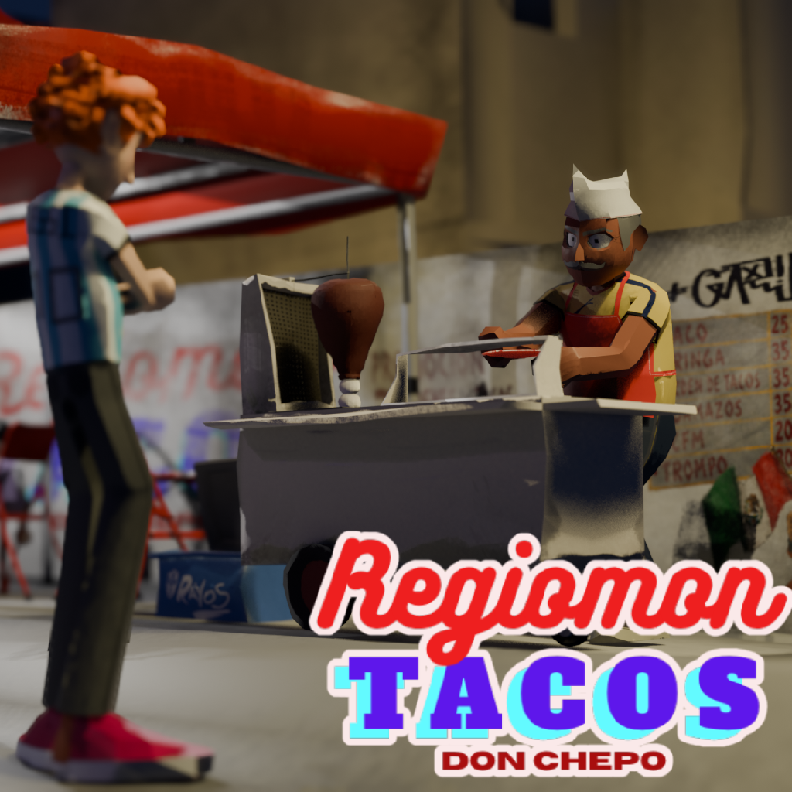
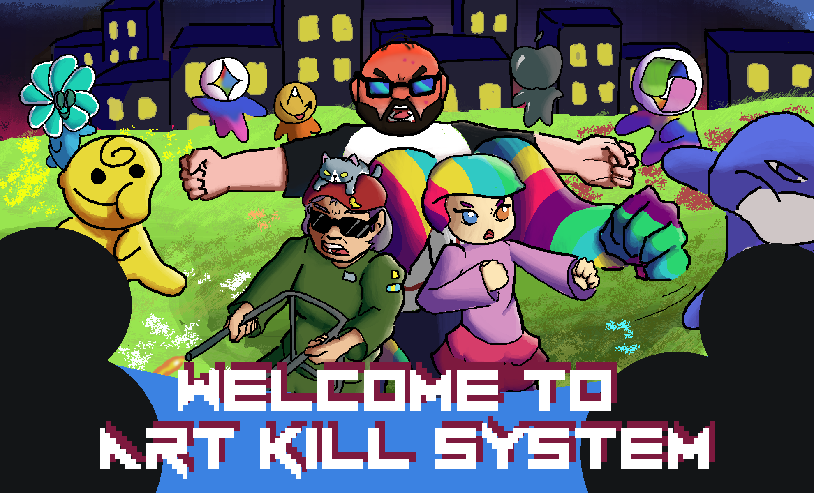
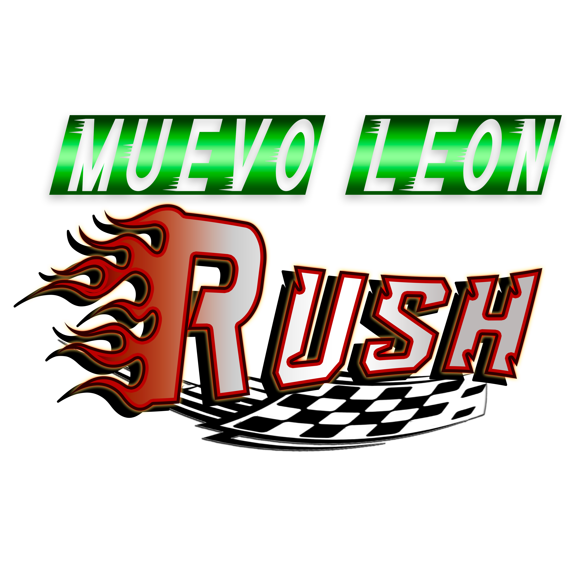

<h1 align="center"> <b>Hi, I'm Manuel Acosta </b>  </h1>

  Software Developer | Game Developer | Multimedia & Digital Animation Student

---

## About Me
I'm a Multimedia and Digital Animation student specializing in programming, with a strong interest in software and game development.

* 🎓 Student at the Faculty of Physical and Mathematical Sciences of the Autonomous University of Nuevo León.
* 🎮 Game Developer using Unity and Godot.
* 🌱 Continuously learning new technologies and development practices.
* 🚀 Looking for internships, professional opportunities, and collaborative projects.

<h4 align="center">Contact</h4>

  

---

## Stack

### Languages

### Game Development

### Databases

### Web

### Tools

### Creative

## Featured Projects

  <table>
    <tr>
      <td width="100%" align="center">
        <h3 align="center">Manchego Studios</h3>
        
        

          
        

        

          I document part of my development journey on YouTube, where I share project progress, prototypes, experiments, and insights from my learning process.
           Manchego Studios serves as a showcase of the projects I enjoy building and the technologies I work with.
           If you're interested in seeing my work beyond source code, feel free to visit my channel and follow the progress of my current and future projects.
        

      </td>
    </tr>
  </table>

 

<table>
<tr>

<td width="33%" align="center">
<h3>RegiomonTacos</h3>

A 3D taco stand simulation game set in a stylized Monterrey-inspired environment. Prepare and serve tacos to customers, improve your skills, and become the city's top taquero. Developed with Unity 6.1.

</td>

<td width="33%" align="center">
<h3>Art Kill System</h3>

A 2D pixel-art survival game set in a dystopian world where artists must face an AI that seeks not only to destroy art, but humanity itself. Developed with Godot 4.6.

</td>

<td width="33%" align="center">
<h3>Muevo León Rush</h3>

A hybrid rhythm and driving game where you take on the role of a bus driver racing to reach each stop on time. Follow the rhythm of the music, dodge traffic, keep your passengers happy, and avoid causing accidents. Developed with Unity 6.1.

</td>

</tr>
</table>

> Feel free to explore my repositories and project documentation to follow my development process and technical progress. Most game projects include playable demos, and I am always open to feedback and suggestions.

---

### GitHub Stats

---

  Thanks for visiting my profile!

